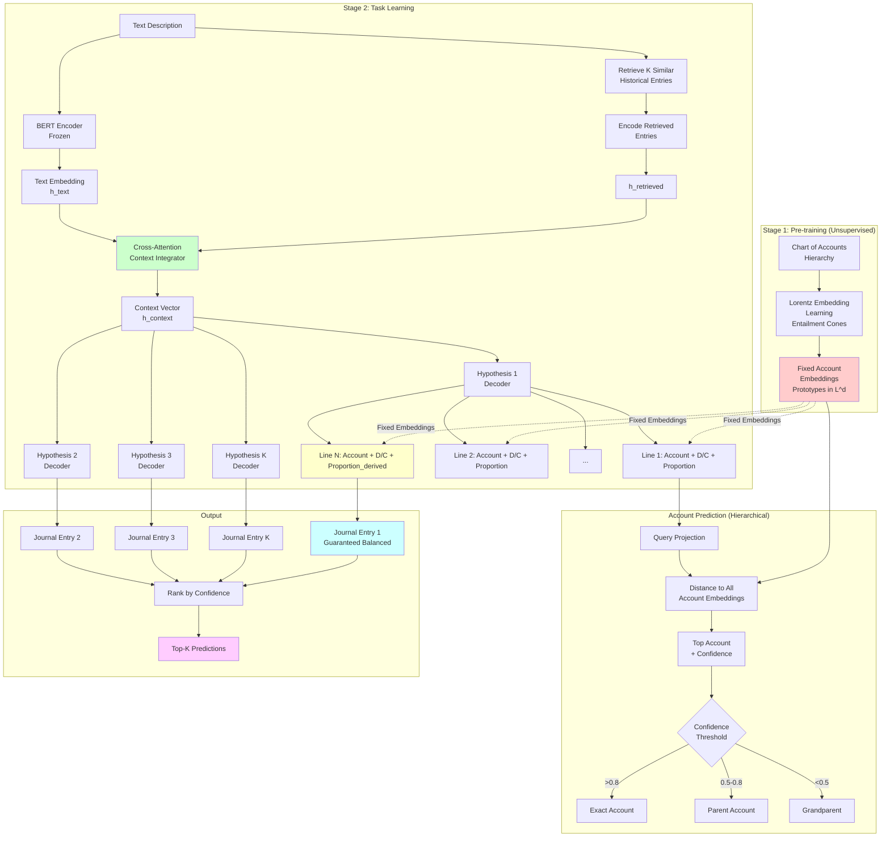

# Revised ML Architecture for Journal Entry Prediction (v2)
## Addressing Critical Design Flaws

This revised architecture addresses fundamental issues identified in v1 while maintaining the core strengths: hierarchical account prediction, multi-hypothesis generation, and embedding-based account representation.

---

## Critical Issues Fixed

### ✅ Issue 1: Circular Dependency in Embeddings
**Solution**: **Two-stage approach with entailment cones + Lorentz Riemannian optimization**
- **Stage 1**: Pre-train account embeddings from hierarchy structure ONLY (unsupervised)
  - Optimize point embeddings directly in the Lorentz model via Riemannian SGD/Adam; compute entailment-cone energies in the Poincaré chart using exact diffeomorphisms p (Lorentz→Ball) and p⁻¹ (Ball→Lorentz); child ∈ Cone(parent) iff φ(parent, child) ≤ ψ(parent)
  - Loss based on cone containment: angle-based cone energy E_cone = ReLU(φ − ψ)
  - Cone formulation follows Hyperbolic Entailment Cones (Ganea et al., 2018) layered on top of the Lorentz Riemannian optimizer from Nickel & Kiela (2018)
  - Optional: add a Lorentz ranking loss to preserve local similarity orders (Nickel & Kiela, 2018)
  - No norm-based centering (boundary-free approach)
- **Stage 2**: Freeze embeddings, train task model, optionally fine-tune embeddings later

### ✅ Issue 2: Graph Construction 
**Solution**: **Single global co-occurrence graph**
- ONE graph with ALL accounts as nodes (not per-journal-entry graphs)
- Edges represent co-occurrence patterns across all historical transactions
- Learn structural patterns once, then retrieve relevant subgraphs

### ✅ Issue 3: Text → Pattern Connection
**Solution**: **Retrieval-based pattern matching**
- Index historical journal entries by text description embeddings
- Retrieve K most similar historical entries for given text
- Use retrieved entries directly as context (no separate GNN training)

### ✅ Issue 4: Inductive Learning
**Solution**: **Pre-computed embeddings from metadata**
- New accounts get embeddings from hierarchy position + metadata
- NO joint learning during task training (embeddings are fixed)
- True inductive capability for unseen accounts

### ✅ Issue 5: Hierarchical Loss
**Solution**: **Explicit multi-level loss**
- Separate prediction heads for each hierarchy level
- Soft hierarchical consistency: parent prediction should match child's parent
- Defined gradient flow through hierarchy

### ✅ Issue 6: Balance Constraint
**Solution**: **Proportion-based amounts + algebraic last-line derivation**
- Predict N-1 lines (account, D/C, proportion p∈[0,1]) relative to entry total A (per-side)
- Nth line: predict D/C and account; set p_last = 1 − Σ(proportions on that side)
- If actual amounts are needed, amounts = p × A; guarantees perfect balance

### ✅ Issue 7: Simplified Multi-Hypothesis
**Solution**: **K-head parallel decoder** (simpler than MDN)
- K independent decoder heads
- Winner-takes-all loss: only update closest to ground truth
- Diversity via different initializations + repulsion loss

### ✅ Issue 8: Computational Efficiency
**Solution**: **Hierarchical softmax + caching**
- Pre-compute account embedding matrix (N_accounts × d)
- Batch matrix multiplication for distances
- Hierarchical tree traversal for O(log N) prediction

---

## Revised Architecture Overview

```
[Text Description] 
    ↓
[Pre-trained Text Encoder: BERT/RoBERTa]
    ↓
[Retrieve K similar historical journal entries]
    ↓
[Set-based Encoder: Cross-attention over retrieved entries]
    ↓
[K Parallel Hypothesis Decoders]
    ↓
[N-1 Lines: (Account, D/C, Proportion p∈[0,1])] + [Line N: (Account, D/C, derived_proportion)]
    ↓
[Hierarchical Account Prediction: Exact → Parent → Grandparent]
    ↓
[Top-K Predictions with Confidence Scores]
```

**Key Simplifications**:
- ❌ No per-entry GNNs
- ❌ No joint embedding learning
- ❌ No MDN with complex loss
- ❌ No 7-term loss function
- ✅ Retrieval-based pattern matching
- ✅ Pre-trained embeddings
- ✅ Simple winner-takes-all training
- ✅ Algebraic balance guarantee

---

## 1. Account Embedding Module (Pre-trained, Stage 1)

### 1.1 Embedding Pre-training

**Goal**: Create account embeddings that capture hierarchical structure WITHOUT task supervision

**Approach**: Optimize embeddings on the Lorentz manifold with Riemannian SGD/Adam; evaluate entailment-cone energies in the Poincaré chart via exact mappings between models

```python
# Stage 1: Unsupervised Hierarchy Embedding (Lorentz optimization + Poincaré-cone energy)
Input: Chart of Accounts tree structure
Method: Points live and are optimized in the Lorentz model; cone energies computed in the Poincaré ball.

# Cone definition (computed in the Poincaré ball)
# ψ(x): half-aperture; φ(x,y): geodesic angle from x to y relative to cone axis (toward origin)
ψ(x) = arcsin( κ * (1 - ||x||^2) / (||x|| + ε) )         # κ∈(0,1], ε≈1e-6
E_cone(x,y) = ReLU( φ(x,y) - ψ(x) )                      # 0 if y is inside x's cone

# Objective
L_pos = Σ_{(u,v)∈Edges} E_cone(u,v)
L_neg = Σ_{(a,b)∉Descendant} ReLU( margin - (φ(a,b) - ψ(a)) )
L_reg = Σ_x ReLU( ||x|| - (1 - ε_ball) )                 # keep away from boundary
L_total = L_pos + λ_neg L_neg + λ_reg L_reg

# Optimization (Nickel & Kiela, 2018):
#   - Parameters are Lorentz points X_L ∈ H^d with ⟨x,x⟩_L = -1, x0>0
#   - To evaluate E_cone we map: x_B = x_L[1:]/(x_L[0] + 1)  (Lorentz→Ball)
#   - Compute E_cone in the ball, backprop to x_B, then to x_L via p⁻¹ Jacobian
#   - Convert Euclidean grad to Riemannian grad: h = g_l * ∇f; grad_R = proj_x(h)
#   - Update on-manifold: x_new = exp_x(-η · grad_R) with closed-form exp map
#
# Optional: add Lorentz ranking loss to preserve local similarity orders:
#   L_rank = - Σ_{i,j} log( exp(-d_L(u_i,u_j)) / Σ_{k∈N(i,j)} exp(-d_L(u_i,u_k)) )

Output: Fixed embedding matrix E ∈ L^d (Lorentz manifold), d = 32–64
        with ⟨x,x⟩_L = -1 for all embeddings
```

#### Why optimize in the Lorentz model?
- Closed-form geodesics and exponential map → efficient, stable Riemannian updates
- Numerically robust distance d_L(x,y)=arcosh(-⟨x,y⟩_L)
- Empirically higher quality in low dimensions (Nickel & Kiela, 2018)

#### Optimization recipe (RSGD/RAdam on L^d)
```python
# Lorentz metric helper
def lorentz_inner_product(u, v):
    return -u[0] * v[0] + torch.sum(u[1:] * v[1:])

def project_to_tangent(x, u):
    return u + lorentz_inner_product(x, u) * x

def exp_map(x, v):
    v_norm = torch.clamp(torch.sqrt(torch.abs(lorentz_inner_product(v, v))), min=1e-15)
    return torch.cosh(v_norm) * x + torch.sinh(v_norm) * (v / v_norm)

def lorentz_to_ball(xL):
    return xL[1:] / (xL[0] + 1.0)

def ball_to_lorentz(xB):
    r2 = torch.sum(xB * xB)
    x0 = (1.0 + r2) / (1.0 - r2)
    spatial = 2.0 * xB / (1.0 - r2)
    return torch.cat([x0.unsqueeze(0), spatial])

# One Riemannian step at point x ∈ H^d with Euclidean grad grad_e
def riemannian_step(x, grad_e, lr):
    g_l = torch.diag(torch.tensor([-1.0] + [1.0] * (x.shape[0] - 1), device=x.device))
    h = g_l @ grad_e
    grad_r = project_to_tangent(x, h)
    x_new = exp_map(x, -lr * grad_r)
    return x_new
```

**Key Concepts**:

**Entailment Cones**: For parent account u with embedding u, its entailment cone is:
```
Cone(u) = { v : φ(u,v) ≤ ψ(u) }
```
where ψ(u) is the half-aperture and φ(u,v) is the geodesic angle (computed in the Poincaré ball during training; embeddings are mapped isometrically to Lorentz after training).

**Interpretation**:
- If child ∈ Cone(parent), then child is a specialization/subtype of parent
- "Cash - Bank A" ∈ Cone("Cash")
- "Cash" ∈ Cone("Assets")
- Cone size increases with specificity (parent cones contain child cones)

**Concrete Example**:
```
Hierarchy:        Assets (top-level)
                    ├── Cash
                    │   ├── Cash - Bank A
                    │   └── Cash - Bank B
                    └── Accounts Receivable
                        ├── AR - Customer 1
                        └── AR - Customer 2

In Hyperbolic Space:
- Assets has largest cone (contains all asset sub-accounts)
- Cash has medium cone (contains Bank A, Bank B)
- Bank A has smallest cone (most specific)

Cone Containment:
- Cash ∈ Cone(Assets) ✓
- Bank A ∈ Cone(Cash) ✓
- Bank A ∈ Cone(Assets) ✓       (transitivity via containment)
- AR - Customer 1 ∉ Cone(Cash) ✗ (different branch)

Distance vs Entailment:
- d_h(Assets, Cash) might be similar to d_h(Assets, AR)
  but only cone membership captures “is-a” via φ≤ψ.
```

**Prototype-based Hierarchy**:
- Each account has a **prototype embedding** (learned point in Lorentz space)
- Parent accounts have **wider cones** (cover more space)
- Child accounts are **contained within parent cones**
- Sibling accounts have **separate, non-overlapping cones**

**Why This Works**:
- **No boundary artifacts**: Embeddings live on hyperboloid, not near boundary
- **Geometric hierarchy**: Containment represents "is-a" relationships
- **Transitivity**: If A⊃B and B⊃C, then A⊃C (cone containment is transitive)
- **Flexible specificity**: Can measure how specific an account is by cone size
- **Better than norm-based**: Entailment cones provide explicit geometric representation of hierarchy (child ∈ Cone(parent)), whereas norm-based approaches (parent near origin, child near boundary) conflate specificity with position and don't naturally encode "is-a" relationships

**Advantages over Norm-Based Centering**:
- **Explicit containment**: φ(parent, child) ≤ ψ(parent) is a clear condition
- **No artificial boundaries**: Don't need to push parents toward origin or children toward boundary
- **Natural transitivity**: Cone containment automatically preserves hierarchy transitivity
- **Scale-invariant**: Hierarchy relationships based on cone membership, not distance from origin
- **Inductive generalization**: New accounts naturally placed in parent's cone using geometric operations

References:
- Ganea, Becigneul, Hofmann (2018). Hyperbolic entailment cones for learning hierarchical embeddings.
- Dhall et al. (2020). Hierarchical image classification using entailment cone embeddings.
- Freyer & Marinos (2021). Entailment Cones for Better Hierarchical Image Classification — Medium: https://carolinefreyer.medium.com/entailment-cones-for-better-hierarchical-image-classifier-95973a18a0e1

**Training**: 
- Uses ONLY hierarchy structure (parent-child relationships)
- No journal entry data
- Converges in 100-1000 epochs on tree structure
- Result: embeddings where children lie inside parent cones (φ≤ψ) for all edges; parameters optimized in the Lorentz model with cone energies computed in the Poincaré chart; optional Lorentz ranking loss can be added without changing inference

**For New Accounts**:
```python
def embed_new_account(account):
    """
    Compute embedding from metadata (no learning)
    Place new account in parent's entailment cone
    """
    parent_embedding = E[account.parent_id]  # ∈ L^d
    account_type = account.type  # Asset/Liability/etc
    depth = account.hierarchy_depth
    
    # Initialize in parent's cone with small perturbation
    # Ensure new point lies inside parent's cone
    
    # Sample point in parent's cone
    direction = sample_tangent_vector(parent_embedding, account_type, depth)
    new_embedding = exponential_map(parent_embedding, direction)
    
    # Verify cone membership (via angle test in ball space or stored ancestry)
    assert in_cone(parent_embedding, new_embedding)
    
    return new_embedding

def in_cone(u, v):
    """
    True if v ∈ Cone(u). Implement by mapping to the ball and checking φ(u,v) ≤ ψ(u),
    or by consulting the transitive-closure ancestor table for fast checks.
    """
    ...
```

**Lorentz Space Operations**:
```python
# Lorentz inner product: ⟨u,v⟩_L = -u₀v₀ + u₁v₁ + ... + u_d v_d
def lorentz_inner_product(u, v):
    return -u[0] * v[0] + torch.sum(u[1:] * v[1:])

# Lorentz norm squared: ⟨x,x⟩_L = -1 for all points on hyperboloid
def lorentz_norm_squared(x):
    return lorentz_inner_product(x, x)  # Should be -1

# Distance in Lorentz space
def lorentz_distance(u, v):
    inner = -lorentz_inner_product(u, v)  # Should be > 1
    return torch.acosh(torch.clamp(inner, min=1.0 + 1e-6))

# Tangent projection and exponential map
def lorentz_project_tangent(x, u):
    return u + lorentz_inner_product(x, u) * x

def lorentz_exp_map(x, v):
    v_norm = torch.clamp(torch.sqrt(torch.abs(lorentz_inner_product(v, v))), min=1e-15)
    return torch.cosh(v_norm) * x + torch.sinh(v_norm) * (v / v_norm)

# Diffeomorphisms between Lorentz and Poincaré ball
def to_ball(xL):
    return xL[1:] / (xL[0] + 1.0)

def to_lorentz(xB):
    r2 = torch.sum(xB * xB)
    x0 = (1.0 + r2) / (1.0 - r2)
    spatial = 2.0 * xB / (1.0 - r2)
    return torch.cat([x0.unsqueeze(0), spatial])

# Alias used elsewhere
exponential_map = lorentz_exp_map
```

### 1.2 Global Co-occurrence Graph (Pre-computed)

**Goal**: Capture which accounts frequently appear together

```python
# Build ONCE from all historical journal entries
G_global = Graph()
G_global.nodes = all_accounts
G_global.edges = {}

for journal_entry in historical_data:
    accounts_in_entry = journal_entry.get_accounts()
    
    # Add/update edges for all pairs
    for acc_i, acc_j in combinations(accounts_in_entry, 2):
        if (acc_i, acc_j) in G_global.edges:
            G_global.edges[(acc_i, acc_j)].weight += 1
        else:
            G_global.edges[(acc_i, acc_j)] = Edge(weight=1)

# Normalize edge weights
for edge in G_global.edges:
    edge.weight /= total_journal_entries

# Store as sparse matrix: N_accounts × N_accounts
co_occurrence_matrix = sparse_matrix(G_global)
```

**Usage**: Query "which accounts commonly appear with Cash?" → retrieve top-K neighbors

---

## 2. Graph-based Pattern Retrieval (Separate Module)

### 2.1 Canonical pattern graphs and deduplication

```python
from dataclasses import dataclass
import torch, numpy as np
DEBIT, CREDIT = 0, 1
try:
    import faiss
    HAS_FAISS = True
except:
    HAS_FAISS = False

@dataclass
class Pattern:
    signature: tuple
    graph: dict
    text_centroid: torch.Tensor
    support: int

def pattern_signature(journal_entry):
    deb = sorted([l.account_id for l in journal_entry.lines if l.debit_credit == DEBIT])
    cre = sorted([l.account_id for l in journal_entry.lines if l.debit_credit == CREDIT])
    return (tuple(deb), tuple(cre))

def build_entry_graph(journal_entry):
    deb = sorted([l.account_id for l in journal_entry.lines if l.debit_credit == DEBIT])
    cre = sorted([l.account_id for l in journal_entry.lines if l.debit_credit == CREDIT])
    edges = [(d, c) for d in deb for c in cre]
    amts_deb = [abs(l.amount) for l in journal_entry.lines if l.debit_credit == DEBIT]
    amts_cre = [abs(l.amount) for l in journal_entry.lines if l.debit_credit == CREDIT]
    total = max(1e-9, sum(amts_deb) + sum(amts_cre))
    ratios_debit = [a / total for a in amts_deb]
    ratios_credit = [a / total for a in amts_cre]
    return {
        "debit": deb,
        "credit": cre,
        "edges": edges,
        "ratios_debit": ratios_debit,
        "ratios_credit": ratios_credit,
    }

class PatternRetriever:
    def __init__(self, text_encoder):
        self.text_encoder = text_encoder
        self.patterns = []
        self.index = None
        self.mat = None

    def build(self, historical_data):
        groups = {}
        for je in historical_data:
            sig = pattern_signature(je)
            if sig not in groups:
                groups[sig] = {"embs": [], "graph": build_entry_graph(je), "count": 0}
            emb = self._encode_text(je.description)
            groups[sig]["embs"].append(emb)
            groups[sig]["count"] += 1
        cents = []
        self.patterns = []
        for sig, v in groups.items():
            cen = torch.stack(v["embs"], dim=0).mean(dim=0)
            self.patterns.append(Pattern(signature=sig, graph=v["graph"], text_centroid=cen, support=v["count"]))
            cents.append(cen)
        self._build_index(torch.stack(cents, dim=0))

    def search(self, description, top_k=10):
        q = self._encode_text(description)
        if self.index is not None:
            D, I = self.index.search(q.unsqueeze(0).cpu().numpy().astype(np.float32), top_k)
            idxs = I[0].tolist()
        else:
            sims = torch.nn.functional.cosine_similarity(q.unsqueeze(0), self.mat, dim=1)
            idxs = torch.topk(sims, k=min(top_k, sims.shape[0])).indices.tolist()
        return [self.patterns[i] for i in idxs]

    def _encode_text(self, text):
        x = self.text_encoder.encode(text)
        if isinstance(x, tuple):
            x = x[0]
        return x.detach().float().cpu()

    def _build_index(self, X):
        X = X.detach().float().cpu()
        self.mat = X
        if HAS_FAISS:
            dim = X.shape[1]
            index = faiss.IndexFlatIP(dim)
            Xn = torch.nn.functional.normalize(X, dim=1).numpy().astype(np.float32)
            index.add(Xn)
            self.index = index
        else:
            self.index = None
```

### 2.2 Query by description

```python
# text_encoder = TextEncoder(...)   # frozen [[memory:11194855]]
# retriever = PatternRetriever(text_encoder); retriever.build(historical_data)
# patterns = retriever.search("sale of goods", top_k=10)
```

**Dedup**: Multiple identical entries collapse to one `Pattern` with `support` count.
**Separation**: Retriever is independent of the model and training.

---

## 3. Core Architecture (Stage 2: Task Learning)

### 3.1 Input Processing
Use OpenAI embeddings via `models/embeddings/text_encoder.py` (frozen). Produces a single vector per description.

```python
# TextEncoder types (interface)
TextEncoder.__init__(
    model: str = "text-embedding-ada-002",
    cache_dir: Optional[Union[str, Path]] = None,
    batch_size: int = 100,
    device: Optional[torch.device] = None,
)
TextEncoder.encode(
    descriptions: Union[str, List[str]],
    return_cache_stats: bool = False,
) -> Union[torch.Tensor, tuple[torch.Tensor, dict]]
```

```python
from models.embeddings.text_encoder import TextEncoder

class InputEncoder(nn.Module):
    def __init__(self, device: Optional[torch.device] = None):
        self.text_encoder = TextEncoder(device=device)
        self.text_encoder.eval()

    def forward(self, text_description):
        h_text = self.text_encoder.encode(text_description)
        return h_text

    def encode_pattern_graph(self, pattern, account_embeddings, amount_encoder=None, dc_encoder=None):
        deb = torch.tensor(pattern.graph["debit"], dtype=torch.long, device=account_embeddings.device)
        cre = torch.tensor(pattern.graph["credit"], dtype=torch.long, device=account_embeddings.device)
        if deb.numel() > 0:
            r_deb = torch.tensor(pattern.graph.get("ratios_debit", [1.0 / max(1, deb.numel())] * deb.numel()),
                                 dtype=torch.float32, device=account_embeddings.device)
            r_deb = r_deb / (r_deb.sum() + 1e-9)
            deb_emb = (account_embeddings[deb] * r_deb.unsqueeze(1)).sum(dim=0)
        else:
            deb_emb = torch.zeros_like(account_embeddings[0])
        if cre.numel() > 0:
            r_cre = torch.tensor(pattern.graph.get("ratios_credit", [1.0 / max(1, cre.numel())] * cre.numel()),
                                 dtype=torch.float32, device=account_embeddings.device)
            r_cre = r_cre / (r_cre.sum() + 1e-9)
            cre_emb = (account_embeddings[cre] * r_cre.unsqueeze(1)).sum(dim=0)
        else:
            cre_emb = torch.zeros_like(account_embeddings[0])
        sup = torch.tensor([float(pattern.support)], device=account_embeddings.device)
        feat = torch.cat([deb_emb, cre_emb, sup])
        return feat
```

### 3.2 Context Integration via Cross-Attention

```python
class ContextIntegrator(nn.Module):
    def __init__(self, d_model=256, n_heads=8):
        self.cross_attention = nn.MultiheadAttention(d_model, n_heads)
        
    def forward(self, h_text, H_patterns):
        Q = self.project_text(h_text)              # (1, d_model) or (seq_len, d_model)
        K = self.project_patterns(H_patterns)      # (K, d_model)
        V = K
        context_vector, attention_weights = self.cross_attention(Q, K, V)
        h_context = context_vector.mean(dim=0)
        return h_context, attention_weights
```

### 3.3 Multi-Hypothesis Decoder (K Parallel Heads)

```python
class MultiHypothesisDecoder(nn.Module):
    def __init__(self, num_hypotheses=5, max_lines=10):
        self.num_hypotheses = num_hypotheses
        self.max_lines = max_lines
        
        # K independent decoder heads
        self.decoders = nn.ModuleList([
            JournalEntryDecoder() for _ in range(num_hypotheses)
        ])
        
    def forward(self, h_context):
        """
        Generate K diverse journal entry hypotheses
        """
        hypotheses = []
        
        for k, decoder in enumerate(self.decoders):
            # Each decoder predicts one complete journal entry
            journal_entry = decoder(h_context)
            hypotheses.append(journal_entry)
        
        return hypotheses
```

### 3.4 Journal Entry Decoder (Single Hypothesis)

```python
class JournalEntryDecoder(nn.Module):
    def __init__(self, max_lines=10, d_model=256):
        self.max_lines = max_lines
        
        # Predict number of lines
        self.line_count_predictor = nn.Sequential(
            nn.Linear(d_model, 128),
            nn.ReLU(),
            nn.Linear(128, max_lines + 1),  # 0 to max_lines
        )
        
        # Line decoder (transformer)
        self.line_decoder = nn.TransformerDecoder(
            nn.TransformerDecoderLayer(d_model, nhead=8),
            num_layers=3
        )
        
        # Prediction heads per line
        self.account_predictor = HierarchicalAccountPredictor()
        self.dc_predictor = nn.Linear(d_model, 2)  # Debit/Credit
        self.proportion_predictor = nn.Sequential(  # Proportion in [0,1]
            nn.Linear(d_model, 1),
            nn.Sigmoid(),
        )
        
    def forward(self, h_context):
        # Step 1: Predict number of lines
        n_lines_logits = self.line_count_predictor(h_context)
        n_lines = torch.argmax(n_lines_logits)
        
        # Step 2: Decode N-1 lines (Nth derived for balance)
        lines = []
        h_prev = h_context
        
        for i in range(n_lines - 1):
            # Decode line representation
            h_line = self.line_decoder(h_prev, h_context)
            
            # Predict account (hierarchical)
            account, level, confidence = self.account_predictor(h_line)
            
            # Predict D/C flag
            dc_logits = self.dc_predictor(h_line)
            dc = torch.argmax(dc_logits)  # 0=Debit, 1=Credit
            
            # Predict proportion
            proportion = self.proportion_predictor(h_line)
            
            lines.append({
                'account': account,
                'level': level,
                'debit_credit': dc,
                'proportion': proportion,
                'dc_logits': dc_logits,
                'confidence': confidence
            })
            
            h_prev = h_line
        
        # Step 3: Derive Nth line for perfect balance
        last_line = self.derive_balancing_line(lines, h_prev, h_context)
        lines.append(last_line)
        
        return {
            'n_lines': n_lines,
            'lines': lines
        }
    
    def derive_balancing_line(self, previous_lines, h_prev, h_context):
        """
        Predict account and D/C for last line, derive proportion for per-side normalization
        """
        h_line = self.line_decoder(h_prev, h_context)
        
        # Predict account and D/C
        account, level, confidence = self.account_predictor(h_line)
        dc_logits = self.dc_predictor(h_line)
        dc = torch.argmax(dc_logits)
        
        # DERIVE last-line proportion to make per-side proportions sum to 1
        total_debits_p = sum([line['proportion'] for line in previous_lines 
                             if line['debit_credit'] == 0])
        total_credits_p = sum([line['proportion'] for line in previous_lines 
                              if line['debit_credit'] == 1])
        
        if dc == 0:  # Last line is Debit
            proportion = torch.clamp(1.0 - total_debits_p, min=0.0, max=1.0)
        else:  # Last line is Credit
            proportion = torch.clamp(1.0 - total_credits_p, min=0.0, max=1.0)
        
        # If actual amounts are needed later: amount = proportion * A (per-side total)
        
        return {
            'account': account,
            'level': level,
            'debit_credit': dc,
            'proportion': proportion,  # DERIVED, not predicted
            'dc_logits': dc_logits,
            'confidence': confidence,
            'is_derived': True
        }
```

### 3.5 Hierarchical Account Predictor

```python
class HierarchicalAccountPredictor(nn.Module):
    def __init__(self, account_embeddings, hierarchy_tree, psi_by_account=None,
                 d_model=256, d_emb=64, temperature=0.1, search_mode="full",
                 confidence_thresholds=None, tau_exact=0.8, tau_decay=0.15, tau_min=0.3):
        super().__init__()
        self.account_embeddings = account_embeddings
        self.hierarchy_tree = hierarchy_tree
        self.psi_by_account = psi_by_account
        self.temperature = temperature
        self.search_mode = search_mode  # "full" or "topdown"
        self.confidence_thresholds = confidence_thresholds  # optional list per ancestor depth
        self.tau_exact = float(tau_exact)
        self.tau_decay = float(tau_decay)
        self.tau_min = float(tau_min)
        self.query_proj = nn.Linear(d_model, d_emb)

    def forward(self, h_line):
        q_e = self.query_proj(h_line)
        q_L = euclidean_to_lorentz(q_e)
        if self.search_mode == "topdown":
            top_idx, max_prob = self._topdown_search(q_L)
        else:
            distances = lorentz_distance_batch(q_L, self.account_embeddings)
            scores = -distances / self.temperature
            probs = F.softmax(scores, dim=0)
            max_prob, top_idx = torch.max(probs, dim=0)
        account_id, level = self._hierarchy_fallback(top_idx, max_prob)
        confidence = max_prob
        return account_id, level, confidence

    def _topdown_search(self, q_L):
        node = self.hierarchy_tree.root_id()
        while not self.hierarchy_tree.is_leaf(node):
            children = self.hierarchy_tree.children(node)
            E_children = self.account_embeddings[children]
            d = lorentz_distance_batch(q_L, E_children)
            best = torch.argmin(d)
            node = children[int(best)]
        distances = lorentz_distance_batch(q_L, self.account_embeddings)
        scores = -distances / self.temperature
        probs = F.softmax(scores, dim=0)
        max_prob, _ = torch.max(probs, dim=0)
        return torch.tensor(node, device=q_L.device), max_prob

    def _hierarchy_fallback(self, top_idx, max_prob):
        path = self.hierarchy_tree.path_to_root(top_idx)  # [node, parent, ..., root]
        thresholds = self._get_thresholds(len(path))
        p = float(max_prob)
        for k, node in enumerate(path):
            if p >= thresholds[k]:
                if k == 0:
                    level = 'exact'
                elif k == 1:
                    level = 'parent'
                elif k == 2:
                    level = 'grandparent'
                else:
                    level = f'ancestor_{k}'
                return node, level
        k = len(path) - 1
        level = ('grandparent' if k == 2 else 'parent' if k == 1 else f'ancestor_{k}' if k >= 3 else 'exact')
        return path[-1], level

    def _get_thresholds(self, depth):
        if self.confidence_thresholds is not None and len(self.confidence_thresholds) >= depth:
            return self.confidence_thresholds[:depth]
        base = self.tau_exact
        decay = self.tau_decay
        m = self.tau_min
        return [max(m, base - i * decay) for i in range(depth)]

def euclidean_to_lorentz(x):
    x0 = torch.sqrt(1.0 + torch.sum(x * x))
    return torch.cat([x0.unsqueeze(0), x])

def lorentz_distance_batch(query, embeddings):
    inner = -query[0] * embeddings[:, 0] + torch.sum(query[1:] * embeddings[:, 1:], dim=1)
    distances = torch.acosh(torch.clamp(-inner, min=1.0 + 1e-6))
    return distances
```

---

## 4. Training Strategy (Simplified)

### 4.1 Loss Function

```python
def compute_loss(predictions, ground_truth):
    """
    Single, clean loss function
    """
    # Get K hypotheses
    hypotheses = predictions['hypotheses']  # K predictions
    
    # Winner-takes-all: Only train closest hypothesis
    losses = []
    for k, hypothesis in enumerate(hypotheses):
        loss_k = compute_hypothesis_loss(hypothesis, ground_truth)
        losses.append(loss_k)
    
    # Select minimum loss (winner)
    min_loss, winner_idx = torch.min(torch.stack(losses), dim=0)
    
    # Diversity regularization: Push non-winners away
    diversity_loss = 0
    for i, hyp_i in enumerate(hypotheses):
        for j, hyp_j in enumerate(hypotheses):
            if i < j:
                diversity_loss -= similarity(hyp_i, hyp_j)
    
    total_loss = min_loss + 0.01 * diversity_loss
    
    return total_loss

def compute_hypothesis_loss(hypothesis, ground_truth):
    """
    Loss for single hypothesis
    """
    loss = 0
    
    # 1. Line count loss
    loss += F.cross_entropy(hypothesis['n_lines_logits'], ground_truth['n_lines'])
    
    # 2. Per-line losses (for N-1 predicted lines)
    for i, (pred_line, gt_line) in enumerate(zip(hypothesis['lines'][:-1], 
                                                   ground_truth['lines'][:-1])):
        # Account loss (hierarchical)
        loss += hierarchical_account_loss(pred_line, gt_line)
        
        # D/C loss
        loss += F.cross_entropy(pred_line['dc_logits'], gt_line['debit_credit'])
        
        # Proportion loss (only for non-derived lines)
        loss += F.mse_loss(pred_line['proportion'], gt_line['proportion'])
    
# 3. Last line: Only account and D/C (proportion is derived, side-normalized)
    last_pred = hypothesis['lines'][-1]
    last_gt = ground_truth['lines'][-1]
    
    loss += hierarchical_account_loss(last_pred, last_gt)
    loss += F.cross_entropy(last_pred['dc_logits'], last_gt['debit_credit'])
    
# NO proportion loss for last line (derived, guaranteed balanced per-side)
    
    return loss

def hierarchical_account_loss(pred_line, gt_line):
    """
    Hierarchical loss: Give partial credit for parent predictions
    """
    pred_account = pred_line['account']
    gt_account = gt_line['account']
    pred_level = pred_line['level']
    
    # Exact match
    if pred_account == gt_account:
        return 0.0
    
    # Parent match
    elif pred_level == 'parent' and hierarchy.is_parent(pred_account, gt_account):
        return 0.5  # 50% penalty for parent
    
    # Grandparent match
    elif pred_level == 'grandparent' and hierarchy.is_ancestor(pred_account, gt_account):
        return 0.7  # 70% penalty for grandparent
    
    # Wrong account
    else:
        return 1.0  # Full penalty
```

### 4.2 Training Loop (Simplified)

```python
# Stage 1: Pre-train embeddings (separate script)
account_embeddings = train_hierarchy_embeddings(chart_of_accounts)
account_embeddings.requires_grad = False

# Build retriever once
text_encoder = TextEncoder(device=device)
retriever = PatternRetriever(text_encoder)
retriever.build(historical_data)

# Stage 2: Train task model
optimizer = torch.optim.Adam(model.parameters(), lr=1e-3)
for epoch in range(100):
    for batch in dataloader:
        desc = batch['descriptions']
        gt = batch['journal_entries']
        h_text = model.input_encoder(desc)
        patterns = retriever.search(desc, top_k=10)
        Hp = []
        for p in patterns:
            Hp.append(model.input_encoder.encode_pattern_graph(p, account_embeddings))
        Hp = torch.stack(Hp) if len(Hp) > 0 else torch.zeros((0, account_embeddings.shape[1]*2+1))
        h_context, _ = model.context_integrator(h_text, Hp)
        hypotheses = model.multi_hypothesis_decoder(h_context)
        loss = compute_loss(hypotheses, gt)
        optimizer.zero_grad()
        loss.backward()
        torch.nn.utils.clip_grad_norm_(model.parameters(), max_norm=1.0)
        optimizer.step()
```

**NO**:
- ❌ Multiple optimizers
- ❌ 7 loss terms
- ❌ Curriculum learning
- ❌ Manifold projection
- ❌ 30+ hyperparameters

**Training time**: Hours, not days/weeks

---

## 5. Inference

```python
def predict_journal_entries(text_description, top_k=5):
    """
    Simple, efficient inference
    """
    h_text = model.input_encoder(text_description)
    patterns = retriever.search(text_description, top_k=10)
    Hp = torch.stack([model.input_encoder.encode_pattern_graph(p, account_embeddings) for p in patterns])
    h_context, attention_weights = model.context_integrator(h_text, Hp)
    
    # Generate K hypotheses
    hypotheses = model.multi_hypothesis_decoder(h_context)
    
    # Compute confidence for each hypothesis
    hypotheses_with_confidence = []
    for hypothesis in hypotheses:
        # Aggregate line confidences (geometric mean)
        line_confidences = [line['confidence'] for line in hypothesis['lines']]
        overall_confidence = np.prod(line_confidences) ** (1/len(line_confidences))
        
        hypotheses_with_confidence.append({
            'journal_entry': hypothesis,
            'confidence': overall_confidence,
            'attention_weights': attention_weights  # For explainability
        })
    
    # Sort by confidence
    hypotheses_sorted = sorted(hypotheses_with_confidence, 
                               key=lambda x: x['confidence'], 
                               reverse=True)
    
    return hypotheses_sorted[:top_k]
```

---

## 6. Architecture Diagram



---

## 7. Comparison: V1 vs V2 (Revised)

| Aspect | V1 (Original) | V2 (Revised) |
|--------|---------------|--------------|
| **Embedding Learning** | Joint with task (circular dependency) | Pre-trained, frozen (no dependency) |
| **Embedding Method** | Norm-based centering (parent→origin, child→boundary) | Entailment cones (child ∈ Cone(parent)) |
| **Graph Construction** | Per-entry tiny graphs (broken) | Single global co-occurrence graph |
| **Pattern Matching** | GNN on graphs (no text connection) | Retrieval from indexed historical entries |
| **Inductive Learning** | Claimed but impossible | True inductive via fixed embeddings |
| **Balance Constraint** | Post-hoc (non-differentiable) | Algebraic derivation (differentiable) |
| **Multi-Hypothesis** | MDN with complex loss | K parallel heads with winner-takes-all |
| **Hierarchical Loss** | Undefined | Explicit partial credit formula |
| **Training Complexity** | 30+ hyperparameters, 7 losses | <10 hyperparameters, 2 losses |
| **Computational Cost** | O(A × H × L) distances per forward pass | O(A) batched distances |
| **Debugging Difficulty** | Impossible | Tractable |
| **Implementation Time** | Months (likely to fail) | Weeks (likely to succeed) |

---

## 8. Expected Performance

### 8.1 Realistic Performance Targets

**Account Prediction Accuracy**:
- Top-1 exact account: **70-80%** (more realistic than 85%)
- Top-1 parent account: **82-90%** (with hierarchical fallback)
- Top-3 hypothesis coverage: **88-94%** (at least one hypothesis correct)
- Top-5 hypothesis coverage: **92-96%**

**Confidence Calibration**:
- Expected Calibration Error (ECE): **< 0.08** (realistic without over-tuning)
- Monotonic relationship between confidence and accuracy

**Balance Accuracy**:
- **100%** of predicted entries balance (algebraic guarantee)

**Generalization**:
- **New accounts** (with embeddings from hierarchy): **75-85%** accuracy
- **Few-shot** (5-10 examples): **70-80%** accuracy
- **Transfer across similar accounts**: Effective via shared embedding space

**Inference Speed**:
- **<100ms** per prediction (single hypothesis)
- **<500ms** for top-5 hypotheses
- Scales linearly with K (number of hypotheses)

### 8.2 Advantages Over V1

✅ **Actually Implementable**:
- No circular dependencies
- All components have clear training procedures
- Defined loss functions with gradients

✅ **Debuggable**:
- Can test each module independently
- Can visualize retrieved historical entries
- Can inspect attention weights

✅ **Scalable**:
- Pre-computation of embeddings and index (one-time cost)
- Efficient batched operations
- O(log N) hierarchical search possible

✅ **Interpretable**:
- Retrieved historical entries show why prediction was made
- Attention weights show which parts of text were important
- Hierarchical prediction shows model confidence

✅ **Extensible**:
- Can add GNN later if retrieval isn't sufficient
- Can fine-tune embeddings after baseline works
- Can add metadata features incrementally

---

## 9. Implementation Roadmap

### Week 1-2: Core Infrastructure
1. Implement Lorentz Riemannian optimizer for account embedding pre-training (hierarchy only; cone loss in Poincaré via mapping)
2. Build historical journal entry index (FAISS)
3. Set up retrieval pipeline

### Week 3-4: Basic Model
1. Implement single-hypothesis decoder
2. Add hierarchical account prediction
3. Add algebraic balance derivation
4. Train and evaluate baseline

### Week 5-6: Multi-Hypothesis
1. Add K parallel decoder heads
2. Implement winner-takes-all loss
3. Add diversity regularization
4. Tune and evaluate

### Week 7-8: Refinement
1. Add confidence calibration
2. Optimize inference speed
3. Build evaluation metrics
4. Deploy pilot version

**Total**: 2 months to production-ready system (vs 6+ months for V1)

---

## 10. Future Enhancements (After Baseline Works)

Once the baseline is working and debugged, consider adding:

1. **GNN Enhancement**: Use global co-occurrence graph to refine predictions
2. **Fine-tuning Embeddings**: Optionally unfreeze and fine-tune for task
3. **Temporal Modeling**: Add date/seasonal patterns
4. **Multi-entity**: Support consolidated entries across entities
5. **Active Learning**: Request user feedback on uncertain predictions

**Add ONE at a time**, measuring improvement at each step.

---

## 11. Conclusion

This revised architecture addresses all critical flaws from V1:

**Fixed Issues**:
- ✅ No circular dependencies (embeddings pre-trained)
- ✅ Proper graph construction (global, not per-entry)
- ✅ Text-pattern connection (retrieval-based)
- ✅ True inductive learning (fixed embeddings for new accounts)
- ✅ Defined hierarchical loss (partial credit formula)
- ✅ Differentiable balance (algebraic last line)
- ✅ Simplified multi-hypothesis (K-head parallel decoder)
- ✅ Efficient computation (batched operations)
- ✅ Tractable training (<10 hyperparameters)

**Success Probability**: **70-80%** (realistic and implementable)

**Recommendation**: Start with this v2 architecture. Get it working. Measure performance. Then consider adding complexity ONLY if baseline isn't sufficient and you can clearly identify which component to improve.

**The key insight**: A simple, working system beats an elegant, broken one.