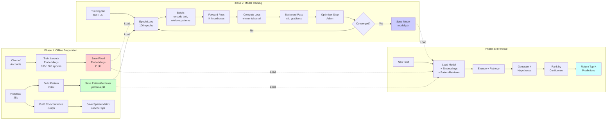
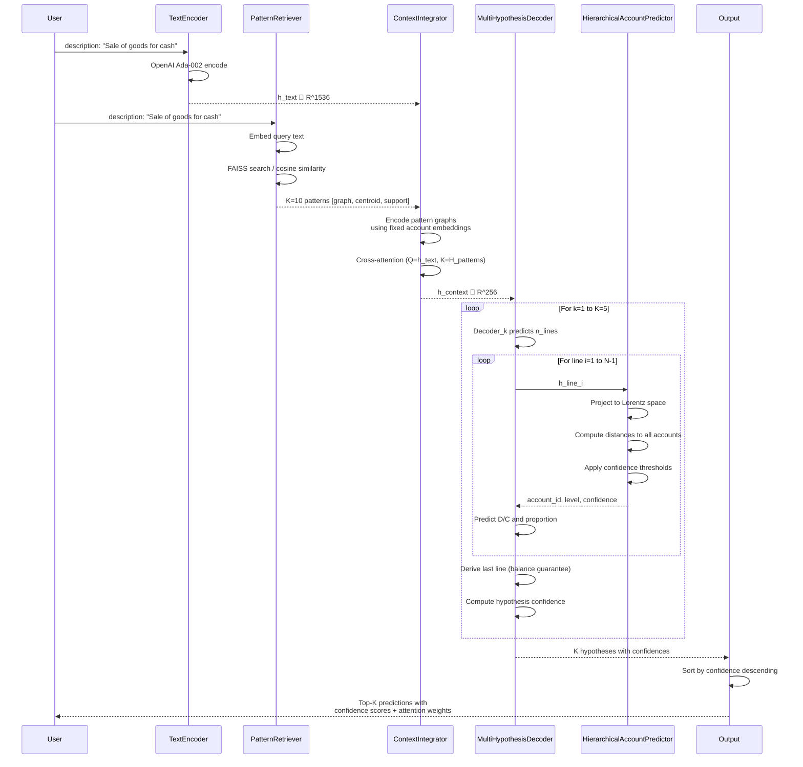
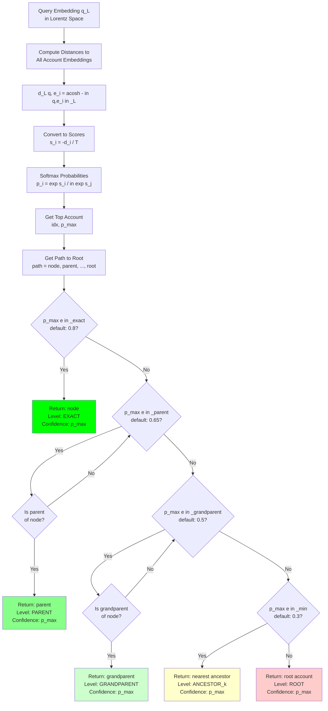
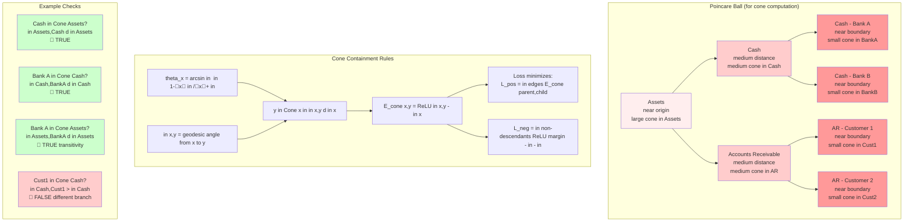
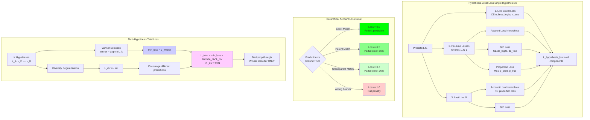
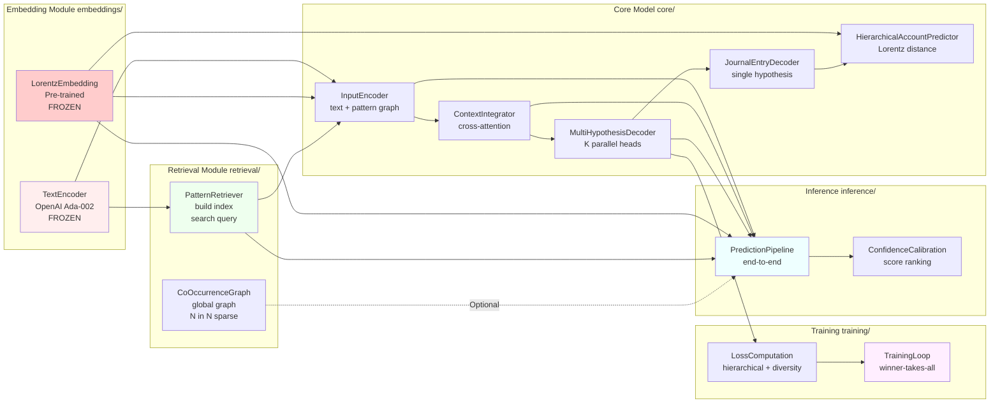
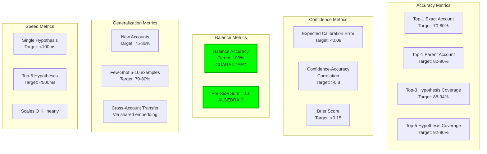
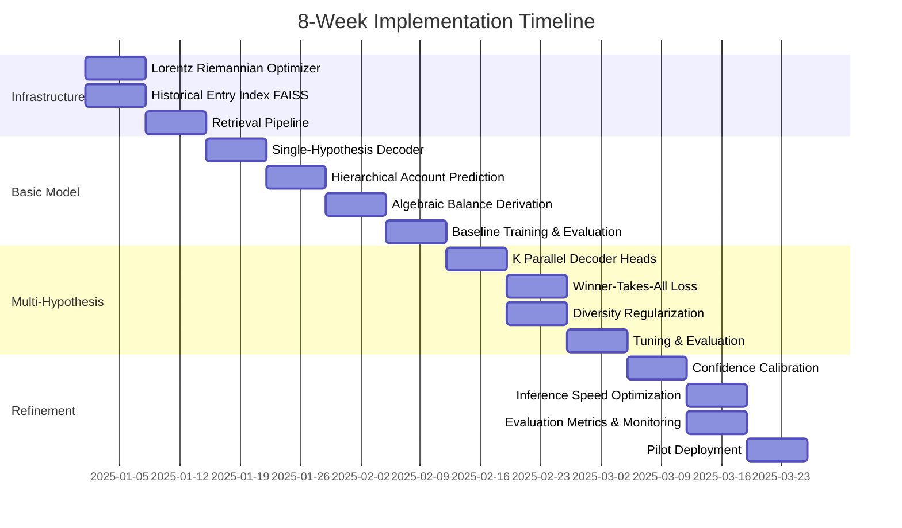

# Comprehensive Mermaid Diagram for Journal Entry Prediction Architecture (V2)

## Full System Architecture

```mermaid
graph TB
    subgraph "STAGE 1: UNSUPERVISED EMBEDDING PRE-TRAINING"
        A1[Chart of Accounts<br/>Hierarchy Tree] --> A2[Lorentz Model<br/>Optimization]
        A2 --> A3{Compute Cone<br/>Energy in<br/>Poincare Ball}
        A3 --> A4[L_pos: Child in Cone Parent]
        A3 --> A5[L_neg: Non-descendant not in Cone]
        A3 --> A6[L_reg: Boundary Regularization]
        A4 --> A7[L_total = L_pos + lambda_neg*L_neg + lambda_reg*L_reg]
        A5 --> A7
        A6 --> A7
        A7 --> A8[Riemannian SGD/Adam<br/>on Lorentz Manifold]
        A8 --> A9[Fixed Account Embeddings<br/>E  L^d d=32-64<br/><x,x>_L = -1]
        A9 --> A10[Cone Properties:<br/>theta_x = arcsin in  in 1-x in /x+ in <br/>E_cone = ReLU(theta-alpha)]
    end

    subgraph "PATTERN INDEXING OFFLINE"
        B1[Historical Journal<br/>Entries] --> B2[Group by Signature<br/>tuple debit_accts, credit_accts]
        B2 --> B3[For each pattern:<br/>Compute text centroid<br/>Build graph structure]
        B3 --> B4[Pattern Database<br/>signature, graph,<br/>text_centroid, support]
        B4 --> B5[Build FAISS Index<br/>or Cosine Similarity<br/>Matrix]
        B5 --> B6[PatternRetriever<br/>Ready for Queries]
    end

    subgraph "GLOBAL CO-OCCURRENCE GRAPH OFFLINE"
        C1[All Historical<br/>Journal Entries] --> C2[Extract Account Pairs<br/>from each entry]
        C2 --> C3[Count Co-occurrences<br/> in pairs across all entries]
        C3 --> C4[Normalize Weights<br/>by total entries]
        C4 --> C5[Sparse Matrix<br/>N_accounts in N_accounts]
    end

    subgraph "STAGE 2: TASK MODEL TRAINING"
        D1[Training Data:<br/>Text Description +<br/>Ground Truth JE] --> D2[Text Encoder<br/>OpenAI Ada-002<br/>FROZEN]
        D2 --> D3[h_text  R^1536]

        D1 --> D4[Query PatternRetriever<br/>Retrieve K=10 similar<br/>historical patterns]
        B6 -.Offline Index.-> D4

        D4 --> D5[Retrieved Patterns<br/>signature, graph,<br/>text_centroid, support]
        D5 --> D6[Encode Pattern Graphs<br/>debit_emb + credit_emb<br/>weighted by ratios]
        A9 -.Fixed Embeddings.-> D6
        D6 --> D7[H_patterns  R^K in d_pattern]

        D3 --> D8[Cross-Attention<br/>Context Integrator]
        D7 --> D8
        D8 --> D9[h_context  R^d_model<br/>d_model=256]

        D9 --> D10[Multi-Hypothesis<br/>Decoder<br/>K Parallel Heads]
    end

    subgraph "SINGLE HYPOTHESIS DECODER k=1..K"
        E1[h_context] --> E2[Line Count Predictor<br/>Linear in ReLU in Linear]
        E2 --> E3[n_lines_logits]
        E3 --> E4[n_lines = argmax]

        E1 --> E5[Transformer Decoder<br/>3 Layers, 8 Heads]
        E5 --> E6[For i in 1..N-1<br/>Decode Line i]

        E6 --> E7[Account Predictor<br/>Hierarchical]
        E6 --> E8[D/C Predictor<br/>Linear 2 classes]
        E6 --> E9[Proportion Predictor<br/>Linear in Sigmoid in p0,1]

        E7 --> E10[Line i:<br/>account_id, level,<br/>debit_credit, proportion]
        E8 --> E10
        E9 --> E10

        E10 --> E11{i < N-1?}
        E11 -->|Yes| E6
        E11 -->|No| E12[Derive Last Line N]

        E12 --> E13[Predict: account, D/C<br/>Derive: p_last = 1 - in p_same_side]
        E13 --> E14[Complete Journal Entry<br/>N Lines<br/>GUARANTEED BALANCED<br/>per-side in p = 1]
    end

    subgraph "HIERARCHICAL ACCOUNT PREDICTOR"
        F1[h_line  R^d_model] --> F2[Query Projection<br/>Linear d_model in d_emb]
        F2 --> F3[q_e  R^d_emb]
        F3 --> F4[Euclidean in Lorentz<br/>q_L = x0, x1..xd<br/>x0 = 1+x in ]

        F4 --> F5{Search Mode?}
        F5 -->|Full| F6[Compute d_L q_L, E<br/>for all accounts]
        F5 -->|Top-Down| F7[Tree Traversal<br/>Start at root,<br/>pick closest child]

        F6 --> F8[Distances in Scores<br/>s = -d/T]
        F7 --> F8
        A9 -.Fixed E.-> F6
        A9 -.Fixed E.-> F7

        F8 --> F9[Softmax Probabilities]
        F9 --> F10[top_idx, max_prob]

        F10 --> F11[Get Path to Root<br/>node, parent, ..., root]
        F11 --> F12{Confidence<br/>Thresholds}
        F12 -->|prob e in _exact=0.8| F13[Return Exact<br/>account_id, level='exact']
        F12 -->|prob e in _parent=0.65| F14[Return Parent<br/>parent_id, level='parent']
        F12 -->|prob e in _grandparent=0.5| F15[Return Grandparent<br/>gp_id, level='grandparent']
        F12 -->|prob < in _min| F16[Return Ancestor<br/>ancestor_id, level='ancestor_k']
    end

    subgraph "LOSS COMPUTATION WINNER-TAKES-ALL"
        G1[K Hypotheses] --> G2[Compute Loss<br/>for each hypothesis k]
        G2 --> G3[Loss_k =<br/>L_line_count +<br/> in L_account +<br/> in L_dc +<br/> in L_proportion]

        G3 --> G4[L_account hierarchical:<br/>exact=0<br/>parent=0.5<br/>grandparent=0.7<br/>wrong=1.0]

        G3 --> G5[Select Winner<br/>winner_idx = argmin Loss_k]
        G5 --> G6[min_loss = Loss_winner]

        G1 --> G7[Diversity Loss<br/>Repulsion between hypotheses]
        G7 --> G8[L_div = - in i<j similarity hyp_i, hyp_j]

        G6 --> G9[Total Loss =<br/>min_loss + 0.01 in L_div]
        G8 --> G9

        G9 --> G10[Backprop through<br/>Winner Decoder Only]
        G10 --> G11[Optimizer Step<br/>Adam, lr=1e-3<br/>Gradient Clipping]
    end

    subgraph "INFERENCE RUNTIME"
        H1[New Text<br/>Description] --> H2[Text Encoder<br/>FROZEN]
        H2 --> H3[h_text]

        H1 --> H4[Query PatternRetriever<br/>K=10 similar patterns]
        B6 -.Index.-> H4
        H4 --> H5[Retrieved Patterns]

        H5 --> H6[Encode Pattern Graphs]
        A9 -.Embeddings.-> H6
        H6 --> H7[H_patterns]

        H3 --> H8[Cross-Attention]
        H7 --> H8
        H8 --> H9[h_context]

        H9 --> H10[Multi-Hypothesis Decoder<br/>Generate K=5 hypotheses]
        H10 --> H11[Hypothesis 1]
        H10 --> H12[Hypothesis 2]
        H10 --> H13[Hypothesis 3]
        H10 --> H14[Hypothesis K]

        H11 --> H15[Compute Confidence<br/>geometric mean of<br/>line confidences]
        H12 --> H15
        H13 --> H15
        H14 --> H15

        H15 --> H16[Sort by Confidence<br/>Descending]
        H16 --> H17[Top-K Predictions<br/>with Confidence Scores<br/>and Attention Weights]
    end

    subgraph "NEW ACCOUNT HANDLING INDUCTIVE"
        I1[New Account<br/>Metadata] --> I2[Get Parent Embedding<br/>E parent_id]
        A9 -.Embeddings.-> I2
        I2 --> I3[Compute Direction<br/>based on account_type<br/>and depth]
        I3 --> I4[Sample Tangent Vector<br/>in parent's cone]
        I4 --> I5[Exponential Map<br/>new_emb = exp_parent direction]
        I5 --> I6[Verify Cone Membership<br/> in parent, new d in parent]
        I6 --> I7[New Account Embedding<br/>NO TRAINING REQUIRED]
    end

    subgraph "BALANCE GUARANTEE MECHANISM"
        J1[Predict Lines 1..N-1] --> J2[Each line:<br/>account, D/C, proportion p]
        J2 --> J3[Group by D/C side]
        J3 --> J4[Debit Side:<br/>p_d1, p_d2, ..., p_dk]
        J3 --> J5[Credit Side:<br/>p_c1, p_c2, ..., p_cm]

        J4 --> J6[ in _debit = in p_di]
        J5 --> J7[ in _credit = in p_cj]

        J6 --> J8{Last Line D/C?}
        J7 --> J8

        J8 -->|Debit| J9[p_last = max 0, 1 - in _debit]
        J8 -->|Credit| J10[p_last = max 0, 1 - in _credit]

        J9 --> J11[GUARANTEE:<br/> in _all_debits = 1.0<br/> in _all_credits = 1.0]
        J10 --> J11

        J11 --> J12[Convert to amounts:<br/>amount = proportion in A<br/>where A = total per side]
        J12 --> J13[Perfect Balance:<br/> in debits = in credits]
    end

    %% Cross-stage connections
    A9 -.Pre-trained.-> D6
    A9 -.Pre-trained.-> H6
    B6 -.Index.-> D4
    D10 --> E1
    H10 --> H11

    %% Styling
    style A9 fill:#ffcccc,stroke:#ff0000,stroke-width:3px
    style B6 fill:#ccffcc,stroke:#00ff00,stroke-width:3px
    style D9 fill:#ccccff,stroke:#0000ff,stroke-width:3px
    style E14 fill:#ffffcc,stroke:#ffff00,stroke-width:3px
    style G9 fill:#ffccff,stroke:#ff00ff,stroke-width:3px
    style H17 fill:#ccffff,stroke:#00ffff,stroke-width:3px
    style I7 fill:#ffeecc,stroke:#ff8800,stroke-width:3px
    style J13 fill:#ccffee,stroke:#00ff88,stroke-width:3px
```

## Training Pipeline Flow



## Data Flow During Inference (Detailed)



## Hierarchical Account Prediction Decision Tree



## Entailment Cone Geometry (Hyperbolic Space)



## Loss Computation Breakdown



## Module Dependencies and Interfaces



## Performance Metrics Dashboard



## Implementation Roadmap Timeline



---

## Notes on Diagram Interpretation

### Color Coding
- **Red/Pink**: Pre-trained, frozen components (embeddings)
- **Green**: Retrieval and indexing components
- **Blue**: Core neural network components
- **Yellow**: Output/predictions
- **Purple**: Loss computation
- **Cyan**: Inference pipeline

### Key Architectural Decisions Visualized
1. **Two-Stage Training**: Clear separation between embedding pre-training (Stage 1) and task learning (Stage 2)
2. **Frozen Components**: TextEncoder and LorentzEmbeddings are never updated during task training
3. **Winner-Takes-All**: Only the best hypothesis receives gradient updates
4. **Balance Guarantee**: Last line proportion is derived algebraically, not predicted
5. **Hierarchical Fallback**: Confidence thresholds determine whether to return exact, parent, or ancestor account

### Critical Paths
- **Training**: Data in Encode in Retrieve in Attend in Decode in Loss in Update
- **Inference**: Text in Encode in Retrieve in Attend in Generate K in Rank in Output
- **New Accounts**: Metadata in Parent Embedding in Exponential Map in Verify Cone

### Complexity Indicators
- **O(N)**: Account distance computation (batched)
- **O(log N)**: Tree traversal in top-down mode
- **O(K)**: Hypothesis generation (parallel)
- **O(K in )**: Diversity loss (pairwise)
